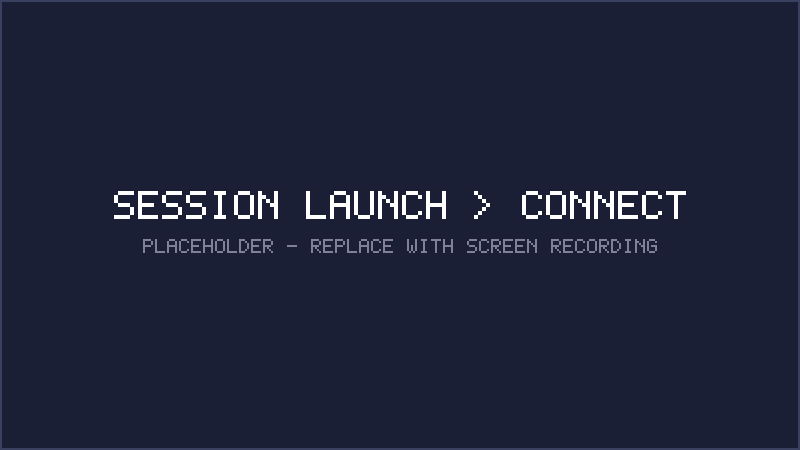
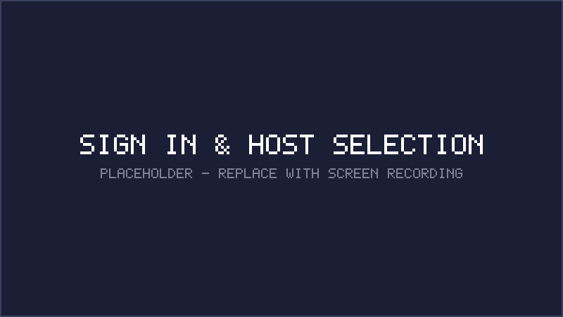
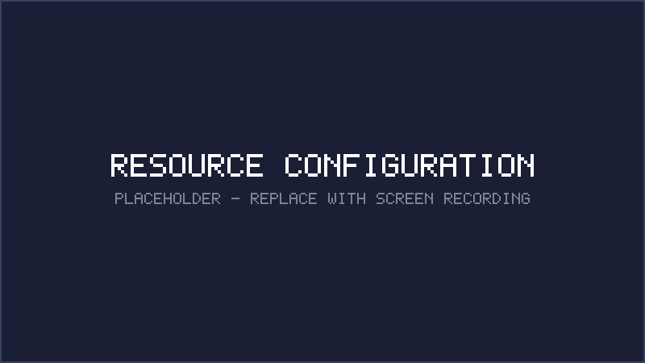
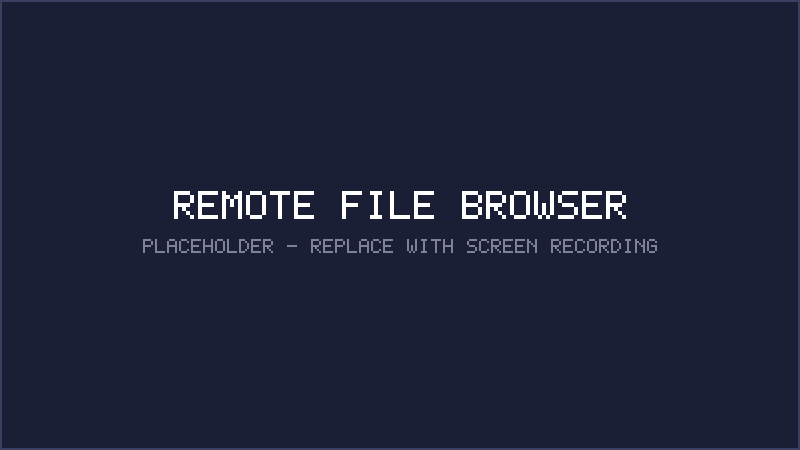

<p align="center">
  <a href="https://marketplace.visualstudio.com/items?itemName=cybershuttle.cybershuttle">
    
  </a>
</p>

<p align="center">
  
</p>

<h1 align="center">CyberShuttle</h1>

<p align="center">
  <strong>Remote HPC development from VS Code — no file syncing, no manual setup.</strong>
</p>

<p align="center">
  <a href="https://marketplace.visualstudio.com/items?itemName=cybershuttle.cybershuttle">VS Code Marketplace</a> ·
  <a href="#quick-start">Quick Start</a> ·
  <a href="CONTRIBUTING.md">Contributing</a>
</p>

---

CyberShuttle is a VS Code extension that lets you work locally while computation runs on a remote HPC cluster or VM. It automatically mounts your workspace on the remote machine through a secure Dev Tunnel with no file syncing and no manual setup. Select a target, launch a session, and your project is ready to use on the remote host.

## Demo

<p align="center">
  
</p>

## Features

### Sign In and Remote Target Setup

CyberShuttle reads your `~/.ssh/config` and lists all configured remote targets — HPC clusters, cloud VMs, or any machine with SSH access. Sign in with a Microsoft account to enable secure tunneling.



### Resource Configuration

When a SLURM scheduler is detected, CyberShuttle queries available partitions, accounts, memory limits, GPUs, and walltime options. Configure jobs from a visual form directly in the sidebar. For plain SSH hosts, connect directly with no extra configuration.



### Session Launch and Connect

Launch a session with one click. Your current VS Code workspace is automatically mounted on the remote machine — no file copying, no rsync, no git push/pull. Click **Connect** to open a new VS Code window on the remote target with your local project files ready to use.

When a session's walltime expires, restart it directly from the sidebar. CyberShuttle remembers your previous configuration.


### Remote File Browser

Browse directories on any connected remote host from the VS Code sidebar. Your local workspace is already mounted and ready in the remote window.



## Key Concepts

| Concept | Description |
|---|---|
| **Workspace Mounting** | Your local project directory is mounted on the remote machine via a secure tunnel. No files are copied or synced. |
| **Dev Tunnel** | A Microsoft Dev Tunnel provides the secure connection between your local VS Code and the remote compute node. |
| **linkspan** | A lightweight agent deployed to the remote host that manages the VS Code Server and Dev Tunnel on the compute node. |
| **Session** | A SLURM job (or direct SSH connection) running linkspan on the remote machine. Sessions can be launched, monitored, restarted, and reattached from the sidebar. |

## Installation

### From VS Code Marketplace

1. Open VS Code
2. Go to Extensions (`Cmd+Shift+X`)
3. Search for **CyberShuttle**
4. Click **Install**

### From Source
To build and install the extension locally for development:

```sh
git clone https://github.com/cyber-shuttle/CS-Bridge.git
cd CS-Bridge
npm run dev
```

This installs dependencies, compiles TypeScript, packages the `.vsix`, and installs it into VS Code. The CyberShuttle icon will appear in your Activity Bar.

## Quick Start

1. Click the **CyberShuttle** icon in the Activity Bar
2. Sign in with your Microsoft account
3. Select a remote target from the dropdown
4. Configure resources (SLURM clusters show partition, memory, GPU, and walltime options)
5. Click **Launch** to start your session
6. Click **Connect** — a new VS Code window opens on the remote machine with your workspace mounted

### Prerequisites

| Requirement | Details |
|---|---|
| VS Code | 1.98 or later |
| SSH Config | At least one remote host in `~/.ssh/config` |
| Microsoft Account | Free account for secure tunnel authentication |
| Remote Host | Any machine with SSH access (HPC cluster, cloud VM, etc.) |
| Internet on Remote | Required for first-time session setup |

## Architecture

```text
Local VS Code                          Remote HPC Cluster
┌───────────────────────┐              ┌────────────────────────────┐
│  CyberShuttle sidebar │──── SSH ────▶│  SLURM scheduler           │
│  (webview UI)         │              │                            │
│                       │              │  Compute Node:             │
│  SSH ControlMaster    │              │  ┌────────────────────┐   │
│  (connection pool)    │              │  │  linkspan            │   │
│                       │              │  │  ├─ VS Code Server │   │
│  Persistent shells    │              │  │  └─ Dev Tunnel ─────┼───┼──▶ devtunnels.ms
│  (file browser,       │              │  └────────────────────┘   │
│   job monitoring)     │              └────────────────────────────┘
└───────────────────────┘
         │
         ▼
  Remote-SSH window
  (connects via tunnel)
```

For full architecture details, source layout, and development setup, see [CONTRIBUTING.md](CONTRIBUTING.md).

## Privacy and Telemetry

CyberShuttle collects anonymous usage data to improve the extension. No personal files, code, or identifying information is collected. Data is only sent with your explicit consent, which you can grant or revoke at any time in **Settings > CyberShuttle > Telemetry**.

## Contributing

Contributions are welcome. See [CONTRIBUTING.md](CONTRIBUTING.md) for development setup, architecture details, and guidelines.

## License

[Apache 2.0](LICENSE)
