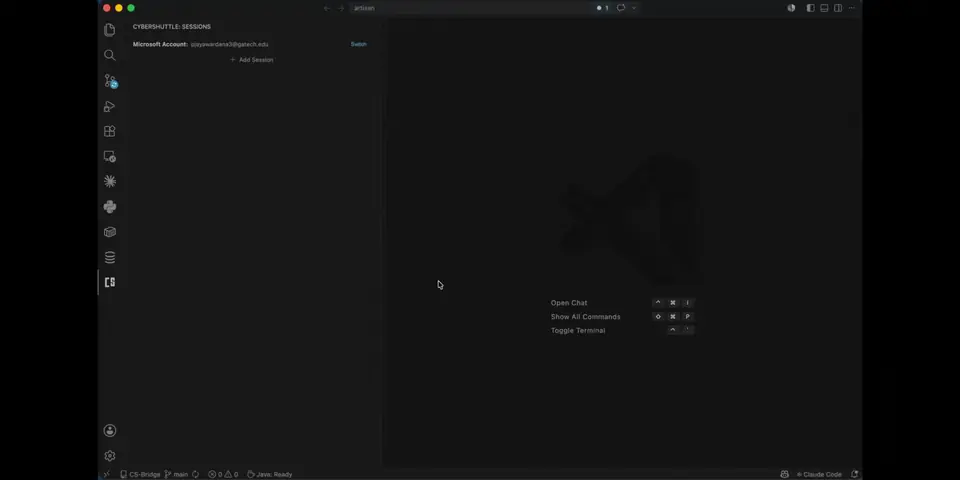
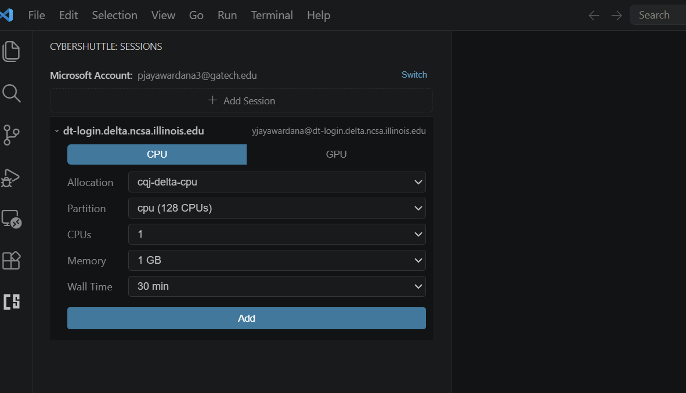
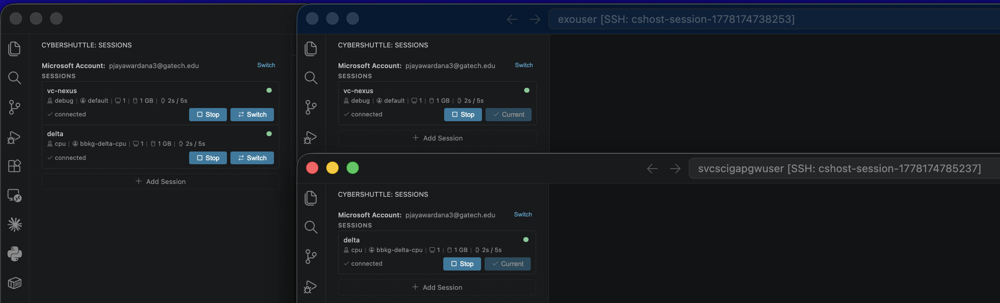

<div>
  
  <strong>CyberShuttle</strong> &nbsp; Remote HPC development from VS Code
  <br>
  <small><a href="https://marketplace.visualstudio.com/items?itemName=cybershuttle.cybershuttle">VS Code Marketplace</a> · <a href="#quick-start">Quick Start</a> · <a href="CONTRIBUTING.md">Contributing</a></small>
  <br clear="all">
  &nbsp;
  <br>
  <a href="https://marketplace.visualstudio.com/items?itemName=cybershuttle.cybershuttle"></a>
  <a href="https://marketplace.visualstudio.com/items?itemName=cybershuttle.cybershuttle"></a>
  <a href="LICENSE"></a>
</div>

<p>
  <br>
  
</p>

CyberShuttle is a VS Code extension for researchers. Edit on your laptop, run on a remote SLURM cluster. Pick a host, choose resources, and a new VS Code window opens on the allocated compute node through a secure Microsoft Dev Tunnel — no job scripts to write, no `tmux` sessions to babysit, no manual port forwarding.

## Contents

- [What you get](#what-you-get)
- [Quick Start](#quick-start)
- [How It Works](#how-it-works)
- [Recipes](#recipes)
- [Files and paths](#files-and-paths)
- [Troubleshooting](#troubleshooting)
- [FAQ](#faq)
- [How it relates to Remote-SSH](#how-it-relates-to-remote-ssh)
- [Roadmap](#roadmap)
- [Citing](#citing) · [Privacy](#privacy) · [Contributing](#contributing) · [Acknowledgments](#acknowledgments) · [License](#license)

## What you get

- **Hosts from your `~/.ssh/config`** — every cluster you already SSH into, listed and one-click connectable.
- **SLURM without scripts** — partition, CPUs, memory, GPUs, walltime in a form; CyberShuttle generates and submits the batch script.
- **Session memory** — restart an expired walltime job in one click; previous selection is preserved.
- **Secure by default** — Microsoft Dev Tunnel handles transport; no new inbound ports on the cluster.
- **OS-native SSH** — CyberShuttle uses your system `ssh` binary with its own ControlMaster pool. No custom SSH stack to trust.
- **A real VS Code window on the compute node** — same editor, debugger, Python/Jupyter extensions, themes, and keybindings as your laptop.

> New to HPC terms? **HPC cluster** = a shared pool of compute nodes. **SLURM** = the scheduler that hands you a node. **Compute node** = where your code actually runs (versus the login node you SSH into). **Dev Tunnel** = Microsoft's encrypted relay so no firewall changes are needed.

## Quick Start

1. Install from the [VS Code Marketplace](https://marketplace.visualstudio.com/items?itemName=cybershuttle.cybershuttle) (or search `CyberShuttle` in Extensions).
2. Click the CyberShuttle icon in the activity bar and sign in with a Microsoft account (used only to authenticate the Dev Tunnel).
3. Pick a host from your `~/.ssh/config`.
4. Fill the resource form (partition, CPUs, memory, GPUs, walltime).
5. Click **Launch**, then **Connect** — a new VS Code window opens on the compute node.

**Requires:** VS Code 1.98+, a SLURM cluster reachable in your `~/.ssh/config`, and a free Microsoft account. Building from source? See [CONTRIBUTING.md](CONTRIBUTING.md#development-setup).

## How It Works

CyberShuttle queries the cluster for available partitions, accounts, and limits, then shows a form:

<p>
  
</p>

Every session appears in the sidebar with live status — switch, stop, or restart from there:

<p>
  
</p>

When you click **Launch**:

1. CyberShuttle generates a SLURM batch script and `sbatch`'es it. The script runs **linkspan** on the allocated compute node (downloading it on first use).
2. **linkspan** starts an SSH server on the compute node and exposes it through a Microsoft Dev Tunnel.
3. CyberShuttle polls `sacct` for job status and tails linkspan's logs from `~/.cybershuttle/logs/` to discover the tunnel.
4. CyberShuttle uses the Microsoft Dev Tunnels SDK (in-process) to forward the remote SSH server to a local `127.0.0.1:N` port, writes a `cshost-<sessionId>` entry in `~/.cybershuttle/ssh_config` pointing at that port, and ensures `Include ~/.cybershuttle/ssh_config` is at the top of your `~/.ssh/config`.
5. **Connect** opens a `vscode-remote://ssh-remote+cshost-<sessionId>/...` URI. VS Code's remote-SSH URI handler invokes your OS `ssh` binary against the alias and attaches a new window; VS Code Server is then installed on the compute node by the standard remote-ssh flow.

Full architecture in [CONTRIBUTING.md](CONTRIBUTING.md#architecture).

## Recipes

**Training a model on a GPU cluster.** Add the login node to `~/.ssh/config`, open CyberShuttle, pick a GPU partition and walltime, **Launch** → **Connect**. The VS Code Python and Jupyter extensions work as usual; `torch.cuda.is_available()` returns `True`.

**Resuming after walltime expiry.** The expired session is flagged in the sidebar. Click **Restart** — CyberShuttle resubmits with the same partition, account, and resource selection. Files on the cluster's shared filesystem are untouched.

**Several clusters at once.** Each cluster is a separate entry; sessions on different clusters run side by side. Switch between them with a click — no extra terminals, no SSH alias juggling.

## Files and paths

**Local:** `~/.cybershuttle/sessions.json` (session metadata, shared across VS Code windows) · `~/.cybershuttle/ssh_config`, `~/.cybershuttle/ssh_keys/`, `~/.cybershuttle/ssh_control/` (generated SSH config, per-session keys, and ControlMaster sockets). CyberShuttle also prepends `Include ~/.cybershuttle/ssh_config` to your `~/.ssh/config` so OS-native `ssh` picks up the per-session aliases. The Microsoft account token is managed by VS Code's built-in authentication provider (OS keychain).

**Remote:** `~/.cybershuttle/bin/linkspan` (downloaded on first connect) · `~/.cybershuttle/logs/linkspan-session-<jobid>.{out,err}` (linkspan output that CyberShuttle tails to discover the tunnel).

Remove both `~/.cybershuttle/` directories — and the `Include` line in `~/.ssh/config` — to reset.

## Troubleshooting

1. **No hosts listed.** `~/.ssh/config` is empty or unreadable. Add a `Host` block with `HostName`, `User`, `IdentityFile`, then refresh.
2. **Microsoft sign-in fails.** Your network may be blocking `login.microsoftonline.com` or `*.devtunnels.ms`. Allowlist these — the Dev Tunnel is the only supported transport today.
3. **Job stuck in `PENDING`.** Cluster busy or request too large. Try smaller resources or check `squeue -u $USER` on the cluster for the reason.
4. **Session fails with "Slurm is not available".** The selected host has no `sinfo` on `PATH`. CyberShuttle currently requires SLURM — see the [Roadmap](#roadmap).
5. **Connect window disconnects immediately.** Tunnel blocked or compute node lost network. Click **Restart**; check `View → Output → CyberShuttle` for the failing step.
6. **Session stuck in `deploying_agent`.** linkspan is downloading on first use. Wait, then check `~/.cybershuttle/logs/` on the remote. If it never moves, **Stop** and **Launch** again.
7. **Permission denied on the remote linkspan binary.** Run `chmod +x ~/.cybershuttle/bin/linkspan` on the remote and **Restart**.

## FAQ

1. **Do I install anything on the remote?** No. CyberShuttle uploads `linkspan` to `~/.cybershuttle/bin/` automatically on first connect.
2. **Does it work without SLURM?** Not yet. The launch path runs `sinfo` and fails if SLURM is missing. Plain-SSH support is on the [Roadmap](#roadmap).
3. **Are my local files copied?** No. You work against the cluster's filesystem directly. Local-workspace mounting is on the [Roadmap](#roadmap).
4. **Walltime expired mid-work?** Click **Restart** to resubmit with the same selection, then **Connect**.
5. **Does CyberShuttle require the Remote-SSH extension?** Not as a hard dependency, but the final attach uses VS Code's `vscode-remote://ssh-remote+...` URI, which is handled by Remote-SSH (or any compatible remote-SSH provider) using your OS `ssh` binary.
6. **VS Code Insiders, Cursor, or other forks?** Targets VS Code 1.98+. Forks with compatible remote-SSH support and Marketplace access usually work but aren't officially tested.
7. **Where do tokens and state live?** Tokens are managed by VS Code's built-in Microsoft authentication provider (OS keychain). Session metadata lives in `~/.cybershuttle/sessions.json`.
8. **Does my institution see what I'm doing?** No more than before — CyberShuttle uses your existing SSH credentials and the Microsoft account you sign in with. Tunnel traffic is encrypted end to end.
9. **Does the cluster session survive closing my laptop?** Yes. The SLURM job and your remote processes keep running until walltime ends. Reopen and **Connect** to reattach.
10. **Windows, macOS, Linux?** Yes on the local side (wherever VS Code and OpenSSH run). The remote needs a Unix-like environment with SSH and SLURM.
11. **First time on a cluster?** Follow the [Quick Start](#quick-start). If you don't have an account yet, ask your advisor or research-computing team.

## How it relates to Remote-SSH

Microsoft's [Remote-SSH](https://marketplace.visualstudio.com/items?itemName=ms-vscode-remote.remote-ssh) attaches a VS Code window to a static SSH host. CyberShuttle handles everything *around* that — the SLURM job, the compute-node allocation, the Dev Tunnel, the per-session SSH config — and at the very end opens a `vscode-remote://ssh-remote+...` URI so Remote-SSH (or any compatible provider) can attach the window using your OS `ssh` binary.

In other words: Remote-SSH alone is enough if you SSH into a static dev box. CyberShuttle is for the case where there's a scheduler between you and the compute, a login node in the way, or a firewall that blocks inbound SSH.

## Roadmap

These items are planned but not yet implemented. A few have placeholder entries in VS Code settings already (`cybershuttle.tunnelProvider`, `cybershuttle.frpServerUrl`, `cybershuttle.frpApiKey`, `cybershuttle.enableFilesystemSync`, `cybershuttle.adminServerUrl`) — those settings don't do anything yet.

- **Plain-SSH / non-SLURM hosts** — connect directly to lab workstations or dev VMs without a scheduler.
- **Self-hosted FRP relay** as an alternative to Microsoft Dev Tunnels for institutions that disallow them.
- **Local-workspace mounting** on the remote via FUSE + sshfs, so the remote VS Code window sees your local files.
- **Opt-in anonymous usage metrics** with an explicit consent flow.
- **Better queue visibility** — position in queue and estimated start time.
- **An alternative to the Microsoft account** requirement for sign-in.

Have a feature request or found a bug? [Open an issue](https://github.com/cyber-shuttle/CS-Bridge/issues).

## Citing

If CyberShuttle supports your research, please cite:

```bibtex
@software{cybershuttle,
  title  = {CyberShuttle: Remote HPC Development from VS Code},
  author = {{ARTISAN Research Group, Georgia Institute of Technology}},
  year   = {2026},
  url    = {https://github.com/cyber-shuttle/CS-Bridge}
}
```

## Privacy

CyberShuttle does not currently collect any usage metrics. Authentication is handled by VS Code's built-in Microsoft authentication provider; SSH credentials and tunnel traffic stay between you, your remote host, and Microsoft Dev Tunnels. An opt-in anonymous metrics flow is on the [Roadmap](#roadmap).

## Contributing

Issues and PRs are welcome — especially from researchers using CyberShuttle on real workloads. See [CONTRIBUTING.md](CONTRIBUTING.md) for architecture, source layout, and dev setup. Bug reports and cluster-specific quirks go in the [issue tracker](https://github.com/cyber-shuttle/CS-Bridge/issues).

## Acknowledgments

Built and maintained by the [ARTISAN research group](https://gt-artisan.github.io/) at Georgia Tech, on top of [linkspan](https://github.com/cyber-shuttle/linkspan), [Microsoft Dev Tunnels](https://learn.microsoft.com/en-us/azure/developer/dev-tunnels/), OpenSSH, and the [Apache Airavata](https://airavata.apache.org/) ecosystem.

## License

[Apache 2.0](LICENSE)
